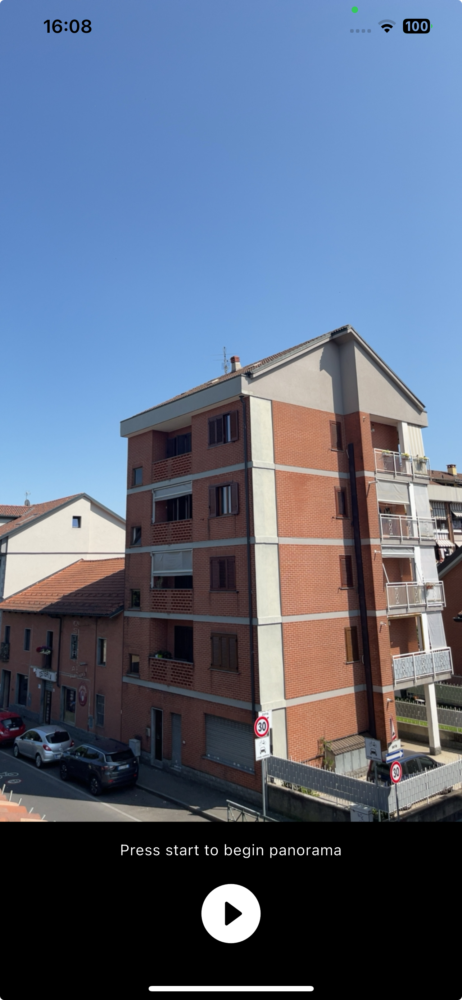

## Features

This package provides a simple way to create panoramic images from a series of photos taken with the camera. It supports both Android and iOS platforms and allows users to stitch images together to create a 360-degree panorama using OpenCV.



## Getting started

To use this package, add `flutter_panorama` as a dependency in your `pubspec.yaml` file.

```yaml
dependencies:
  panorama_creator: ^0.0.1 # replace with the latest version
```

Then, run `flutter pub get` to install the package.

Then, import the package in your Dart code:

```dart
import 'package:flutter_panorama/flutter_panorama.dart';
```

To work, flutter_panorama uses the following dependencies:
- camera
- sensors_plus
- opencv_dart
- path_provider

## Usage

```dart
class PanoramaPackageTest extends StatelessWidget {
  const PanoramaPackageTest({super.key});

  @override
  Widget build(BuildContext context) {
    return PanoramaCreator(
      displayStatus: true, // optional
      backgroundColor: Colors.black, // optional
      loadingWidget: const CircularProgressIndicator(), // optional
      onError: (error) {
        ScaffoldMessenger.of(context).showSnackBar(SnackBar(content: Text('Panorama error: $error')));
      },
      onSuccess: (panoramaPath) {
        Navigator.of(context).push(MaterialPageRoute(builder: (context) => MyPanoramaViewer(file: File(panoramaPath))));
      },
      startWidget: const Icon(Icons.play_circle_fill_rounded, size: 70, color: Colors.white),
      stopWidget: const Icon(Icons.stop_circle_outlined, size: 70, color: Colors.white),
    );
  }
}
```

Giving you the following result:
